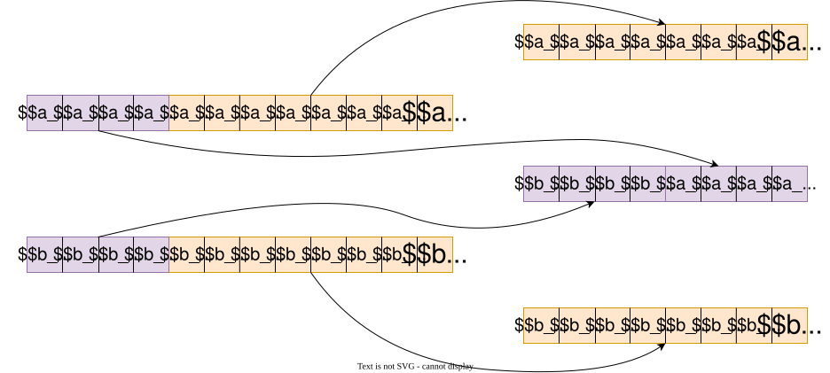
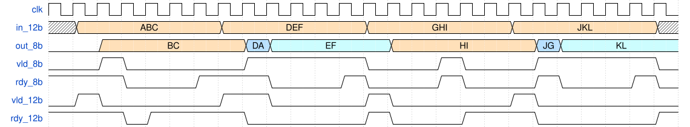
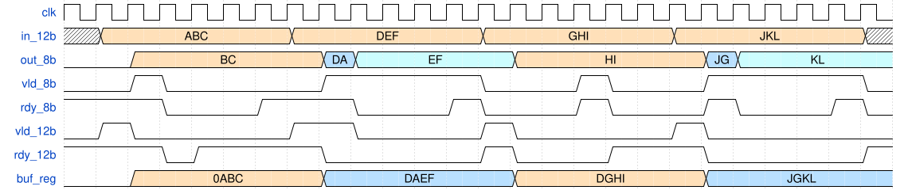
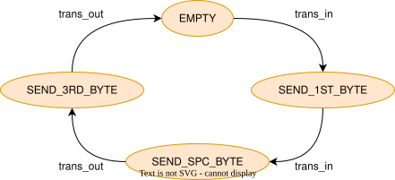
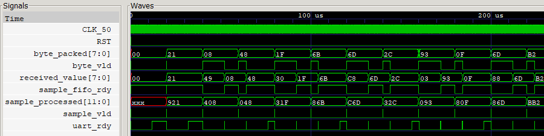
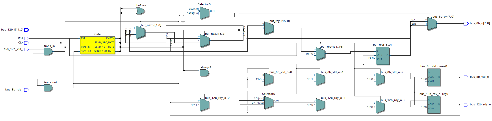
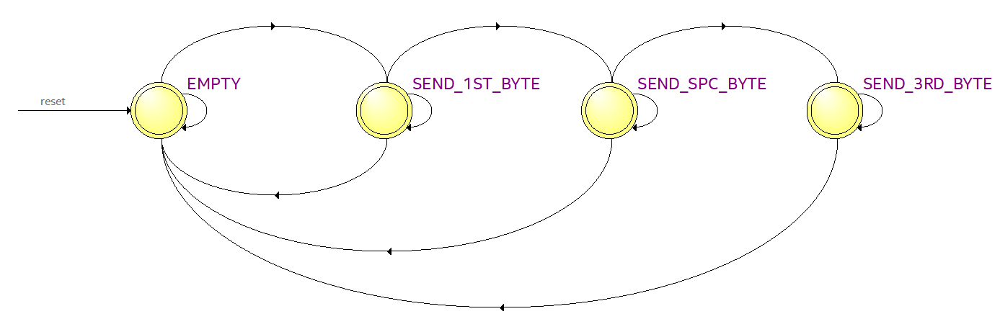
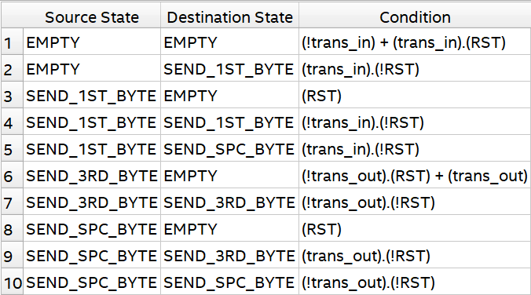
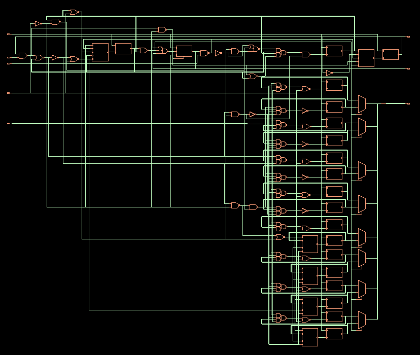

# Пример к FSM

## Задача. Упаковщик байтов

На вход подаётся поток 12-битных значений. 
Необходимо преобразовать поток в 8-битный без отправки пустых бит.
Интерфейс для входа и выхода vld/rdy.

### Пример



### Приблизительная временная диаграмма



Буквами обозначены 4 бита, аналогично 16-ричной системе счисления. Приблизительной она названа потому, что реальный период прихода порядка 1000 периодов CLK, и латентностью обмена в 1-3 такта можно пренебречь.

### Решение

Можно видеть, чётные и нечетные входные байты надо обрабатывать по-разному. Более того, на выходе есть три различных типа байт. Для управления схемами с числом состояний удобно реализовывать через КА.

Схеме необходимо хранить биты a[11:8] до получения следующего пакета и следующий пакет. Вводим 16-битный регистр buf_reg. Определим его содержимое для показанной выше диаграммы.



### Выбираем состояния для автомата

Естественно основываться на состоянии внутреннего регистра.

- ```EMPTY``` - регистр пустой
- ```SEND_1ST_BYTE``` - в регистр записали первый пакет и начали передачу младших 8 бит
- ```SEND_SPC_BYTE``` - после зачитывания первого байта его можно перезаписать; получаем второй пакет и отправляем старшие биты двух пакетов
- ```SEND_3RD_BYTE``` - после отправки старших бит отправляем младшие биты второго пакета, после отправки возвращаемся в состояние EMPTY

Соответственно, a[7:0] назовём первым байтом, {b[11:8], a[11:8]} - особым (вторым) и b[7:0] - третьим байтом.

Объявляем состояния ```state```, вводим буферный регистр ```buf_reg``` и сигналы, соответствующие передаче данных на вход и выход. ```buf_we``` - сигнал управления записью в регистр.

```verilog
enum logic [1:0] {
    EMPTY          = 2'b00,
    SEND_1ST_BYTE  = 2'b01,
    SEND_SPC_BYTE  = 2'b10,
    SEND_3RD_BYTE  = 2'b11
} state, next_state;

logic [15:0] buf_reg;
logic [15:0] buf_next;

logic trans_in;
logic trans_out;

logic buf_we;

assign trans_in  = bus_12b_vld_i && bus_12b_rdy_o;
assign trans_out = bus_8b_rdy_i  && bus_8b_vld_o;
```

### Описываем логику переходов и управления. 

- Запись в буфер происходит, только когда есть на входе происходит передача данных (```trans_in```), при этом нельзя перезаписывать неотправленные данные.
- По умолчанию записывать будем в младшие биты буфера, однако после отправки первого байта нужно сформировать особый байт, для чего в состоянии ```SEND_1ST_BYTE``` старшие 4 бита сдвигаются.
- Из состояния "пусто" естественно выходить при записи. Повторная запись будет возможна только после отправки первого байта, что будет реализовано отдельно. Тем не менее, получение второго пакета  будет означать готовность второго и третьего байта, то есть, переход из ```SEND_1ST_BYTE``` в ```SEND_SPC_BYTE``` происходит по записи. Отправка второго и третьего байта будут завершаться при получении сигнала о чтении ```trans_out```.

Логика переходов автомата (в упрощённом виде, без RST) будет выглядеть так:



Ниже описание автомата на SystemVerilog.

```verilog
always_comb begin
    buf_we = '0;
    next_state = state;
    bus_8b_o = buf_reg[7:0];
    buf_next = {buf_reg[15:12], bus_12b_i};
    case (state)
        EMPTY: begin
            if (trans_in) begin
                buf_we = '1;
                next_state = SEND_1ST_BYTE;
            end
        end
        SEND_1ST_BYTE: begin
            if (trans_in) begin
                buf_we = '1;
                buf_next = {bus_12b_i[11:8], buf_reg[11:8], bus_12b_i[7:0]};
                next_state = SEND_SPC_BYTE;
            end
        end
        SEND_SPC_BYTE: begin
            bus_8b_o = buf_reg[15:8];
            if (trans_out) begin
                next_state = SEND_3RD_BYTE;
            end

        end
        SEND_3RD_BYTE: begin
            if (trans_out) begin
                next_state = EMPTY;
            end
        end
    endcase
end

always_ff @(posedge CLK) begin
    if (RST)
        state <= EMPTY;
    else
        state <= next_state;
end

endmodule
```

### Описываем логику чтения и записи

Получить пакет можно, когда буфер пуст, или после отправки первого байта. Также, чтобы сократить задержку при переходе в состояние ```EMPTY```, можно сообщить о готовности сразу после отправки третьего байта, что из-за буфера на ```bus_12b_rdy``` следует делать в состоянии ```SEND_3RD_BYTE```.  

```verilog
always_ff @(posedge CLK) begin
    if (RST) begin
        bus_12b_rdy_o <= '0;
    end else begin
        if (trans_in)
            bus_12b_rdy_o <= '0;
        else begin
            case (state)
                EMPTY:
                    bus_12b_rdy_o <= '1;
                SEND_1ST_BYTE: begin
                    if (trans_out)
                        bus_12b_rdy_o <= '1;
                end
                SEND_SPC_BYTE: begin
                    bus_12b_rdy_o <= '0;
                end
                SEND_3RD_BYTE: begin
                    if (trans_out)
                        bus_12b_rdy_o <= '1;
                end
            endcase
        end
    end
end
```

Логика отправки проще. Данные становятся действительными при получении и перестают быть такими при отправке. Исключение - состояние ```SEND_SPC_BYTE```, в котором готовыми становятся сразу два байта, поэтому опускать ```bus_8b_vld``` не нужно. Логика записи требует учесть разрешение записи ```buf_we``` и особенности, формируемые конечным автоматом в ```buf_next```.

```verilog
always_ff @(posedge CLK) begin
    if (RST) begin
        bus_8b_vld_o <= '0;
    end else begin
        if (trans_in)
            bus_8b_vld_o <= '1;
        else if (trans_out && (state != SEND_SPC_BYTE))
            bus_8b_vld_o <= '0;
    end
end

always_ff @(posedge CLK) begin
    if (RST)
        buf_reg <= '0;
    else if (buf_we)
        buf_reg <= buf_next;
end
```

### Полный код на SystemVerilog:

```verilog
module buf_12_to_8 (
    input  logic CLK,
    input  logic RST,

    input  logic [11:0] bus_12b_i,
    input  logic        bus_12b_vld_i,
    output logic        bus_12b_rdy_o,

    output logic [07:0] bus_8b_o,
    input  logic        bus_8b_rdy_i,
    output logic        bus_8b_vld_o
);

enum logic [1:0] {
    EMPTY          = 2'b00,
    SEND_1ST_BYTE  = 2'b01,
    SEND_SPC_BYTE  = 2'b10,
    SEND_3RD_BYTE  = 2'b11
} state, next_state;

logic [15:0] buf_reg;
logic [15:0] buf_next;

logic trans_in;
logic trans_out;

logic buf_we;

assign trans_in  = bus_12b_vld_i && bus_12b_rdy_o;
assign trans_out = bus_8b_rdy_i  && bus_8b_vld_o;

always_comb begin
    buf_we = '0;
    next_state = state;
    bus_8b_o = buf_reg[7:0];
    buf_next = {buf_reg[15:12], bus_12b_i};
    case (state)
        EMPTY: begin
            if (trans_in) begin
                buf_we = '1;
                next_state = SEND_1ST_BYTE;
            end
        end
        SEND_1ST_BYTE: begin
            if (trans_in) begin
                buf_we = '1;
                buf_next = {bus_12b_i[11:8], buf_reg[11:8], bus_12b_i[7:0]};
                next_state = SEND_SPC_BYTE;
            end
        end
        SEND_SPC_BYTE: begin
            bus_8b_o = buf_reg[15:8];
            if (trans_out) begin
                next_state = SEND_3RD_BYTE;
            end

        end
        SEND_3RD_BYTE: begin
            if (trans_out) begin
                next_state = EMPTY;
            end
        end
    endcase
end

always_ff @(posedge CLK) begin
    if (RST) begin
        bus_12b_rdy_o <= '0;
    end else begin
        if (trans_in)
            bus_12b_rdy_o <= '0;
        else begin
            case (state)
                EMPTY:
                    bus_12b_rdy_o <= '1;
                SEND_1ST_BYTE: begin
                    if (trans_out)
                        bus_12b_rdy_o <= '1;
                end
                SEND_SPC_BYTE: begin
                    bus_12b_rdy_o <= '0;
                end
                SEND_3RD_BYTE: begin
                    if (trans_out)
                        bus_12b_rdy_o <= '1;
                end
            endcase
        end
    end
end

always_ff @(posedge CLK) begin
    if (RST) begin
        bus_8b_vld_o <= '0;
    end else begin
        if (trans_in)
            bus_8b_vld_o <= '1;
        else if (trans_out && (state != SEND_SPC_BYTE))
            bus_8b_vld_o <= '0;
    end
end

always_ff @(posedge CLK) begin
    if (RST)
        buf_reg <= '0;
    else if (buf_we)
        buf_reg <= buf_next;
end

always_ff @(posedge CLK) begin
    if (RST)
        state <= EMPTY;
    else
        state <= next_state;
end

endmodule
```

### Результат симуляции (частота CLK 50 МГц)



### Синтез под FPGA

Схема в RTL viewer



Конечный автомат целиком





### Синтез под ASIC



## Задача. Распаковщик байтов

Описать схему, реализующую обратную операцию. Хотя практического смысла в 12-битных шинах меньше (в предыдущей задаче она возникала на выходе АЦП), логика управления аналогичная. 

Реализовать схему, собирающую байты в 32-битные значения.
