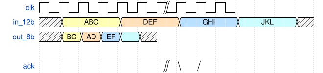

# Пример к FSM

## Задача. Упаковщик байтов

На вход подаётся поток 12-битных значений. 
Необходимо преобразовать поток в 8-битный без отправки пустых бит.
Интерфейс для входа и выхода vld/rdy.

### Пример:


### Решение

Можно видеть, чётные и нечетные входные байты надо обрабатывать по-разному. Более того, на выходе есть три различных типа байт. Для управления схемами с числом состояний удобно реализовывать через КА.

Схеме необходимо хранить биты a[11:8] до получения следующего пакета и следующий пакет. Вводим 16-битный регистр buf_reg. 

Выбираем состояния для автомата. Естественно основываться на состоянии внутреннего регистра.

- EMPTY - регистр пустой
- SEND_1ST_BYTE - в регистр записали первый пакет и начали передачу младших 8 бит
- SEND_SPC_BYTE - после зачитывания первого байта его можно перезаписать; получаем второй пакет и отправляем старшие биты двух пакетов
- SEND_3RD_BYTE - после отправки старших бит отправляем младшие биты второго пакета, после отправки возвращаемся в состояние EMPTY


```verilog
module buf_12_to_8 (
    input  logic CLK,
    input  logic RST,

    input  logic [11:0] bus_12b_i,
    input  logic        bus_12b_vld_i,
    output logic        bus_12b_rdy_o,

    output logic [07:0] bus_8b_o,
    input  logic        bus_8b_rdy_i,
    output logic        bus_8b_vld_o
);

enum logic [1:0] {
    EMPTY          = 2'b00,
    SEND_1ST_BYTE  = 2'b01,
    SEND_SPC_BYTE  = 2'b10,
    SEND_3RD_BYTE  = 2'b11
} state, next_state;

logic [15:0] buf_reg;
logic [15:0] buf_next;

logic trans_in;
logic trans_out;

logic buf_we;

assign trans_in  = bus_12b_vld_i && bus_12b_rdy_o;
assign trans_out = bus_8b_rdy_i  && bus_8b_vld_o;

always_comb begin
    buf_we = '0;
    next_state = state;
    bus_8b_o = buf_reg[7:0];
    buf_next = {buf_reg[15:12], bus_12b_i};
    case (state)
        EMPTY: begin
            if (trans_in) begin
                buf_we = '1;
                next_state = SEND_1ST_BYTE;
            end
        end
        SEND_1ST_BYTE: begin
            if (trans_in) begin
                buf_we = '1;
                buf_next = {bus_12b_i[11:8], buf_reg[11:8], bus_12b_i[7:0]};
                next_state = SEND_SPC_BYTE;
            end
        end
        SEND_SPC_BYTE: begin
            bus_8b_o = buf_reg[15:8];
            if (trans_out) begin
                next_state = SEND_3RD_BYTE;
            end

        end
        SEND_3RD_BYTE: begin
            if (trans_out) begin
                next_state = EMPTY;
            end
        end
    endcase
end

always_ff @(posedge CLK) begin
    if (RST) begin
        bus_12b_rdy_o <= '0;
    end else begin
        if (trans_in)
            bus_12b_rdy_o <= '0;
        else begin
            case (state)
                EMPTY:
                    bus_12b_rdy_o <= '1;
                SEND_1ST_BYTE: begin
                    if (trans_out)
                        bus_12b_rdy_o <= '1;
                end
                SEND_SPC_BYTE: begin
                    bus_12b_rdy_o <= '0;
                end
                SEND_3RD_BYTE: begin
                    if (trans_out)
                        bus_12b_rdy_o <= '1;
                end
            endcase
        end
    end
end

always_ff @(posedge CLK) begin
    if (RST) begin
        bus_8b_vld_o <= '0;
    end else begin
        if (trans_in)
            bus_8b_vld_o <= '1;
        else if (trans_out && (state != SEND_SPC_BYTE))
            bus_8b_vld_o <= '0;
    end
end

always_ff @(posedge CLK) begin
    if (RST)
        buf_reg <= '0;
    else if (buf_we)
        buf_reg <= buf_next;
end

always_ff @(posedge CLK) begin
    if (RST)
        state <= EMPTY;
    else
        state <= next_state;
end

endmodule

```




{signal: [
  {name: 'clk', wave: 'p.....|...'},
  {name: 'in_12b', wave: 'x2.....2.....2.....2.....x', data: ['ABC', 'DEF', 'GHI', 'JKL']},
  {name: 'out_8b', wave: 'x.2....2...2...2...2...2..', data: ['BC', 'AD', 'EF', 'HI', 'GJ', 'KL']},
  {name: 'vld_8b', wave: '0.10....|01.'},
  {name: 'rdy_8b', wave: '1..0..1..|01.'},
  {name: 'vld_12b', wave: '010....|01.'},
  {name: 'rdy_12b', wave: '1.0...1|01.'},
]}