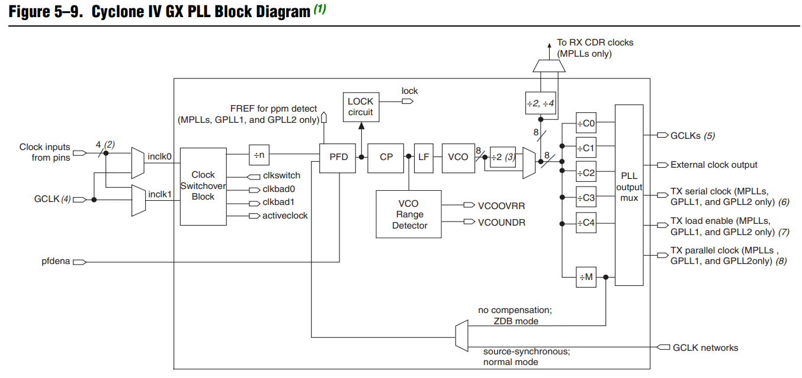
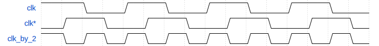

# Умножение частот

В этом посте поговорим об умножении частоты прямоугольных сигналов на 2.

В цифровой схемотехнике, когда нужен clk с частотой ниже имеющейся, часто используют счётчик в качестве преобразователя. Так можно частоту поделить на 2 в степени, равной разрядности счётчика. Однако, этот способ не даёт возможности увеличить частоту сигнала. Для этого сигнал удвоенной частоты должен переключаться не только при изменении входного сигнала, но и в момент, когда все сигналы постоянны.

В ПЛИС (например, Altera Cyclone IV, как на схеме ниже) в этом случае используют аналоговые блоки автоподстройки частоты – PLL. Это большие схемы, в которых генератором управляют через отрицательную обратную связь.

Реализовать умножение частоты на 2, на самом деле, значительно проще. Достаточно сместить исходный сигнал clk на четверть периода. Далее можно использовать комбинационную логику.

Как видим, нужно выполнить XOR между исходным и смещённым сигналами.

Остаётся аналоговая часть: как сдвинуть сигнал на четверть периода?

Как вариант - RC-цепью внести задержку распространения. Возможно, это первый вариант, который придет в голову. Основной недостаток - величина задержки зависит от R и C, но не от частоты исходного сигнала. То есть, нужно или менять номиналы подключением или отключением резисторов/конденсаторов, или использовать управляемые элементы (например, транзисторы вместо резисторов).

Второй вариант от частоты зависит значительно меньше: нужно выделить треугольный сигнал, который будет повышаться, когда на входе 1, и понижаться, когда 0. Соответственно, на выход нужно подавать 1, когда величина сигнала больше его среднего значения.

Реализуется треугольный сигнал, на самом деле, той же RC-цепочкой. Переходные процессы в ней экспоненциальные, асимметричные. Из-за этого цифровой сигнал, полученный с неё по сформулированному условию, тоже будет асимметричным (длительность 1 и 0 будут отличаться), что может быть нежелательно. Для устранения этого эффекта нужно выбирать номиналы так, чтобы время релаксации RC было значительно меньше периода, или просто заменить резистор на источник тока, то есть, транзистор. 

Достаточно удобно использовать второй вариант. Интегральные транзисторы значительно компактнее резисторов больших номиналов. Правда, конденсатор нужно как заряжать, так и разряжать. Для этого вместо обычного транзистора можно использовать приоткрытый проходной ключ. Так схема будет заряжаться и разряжаться одинаково и, если не линейно, то по крайней мере, не экспоненциально.

