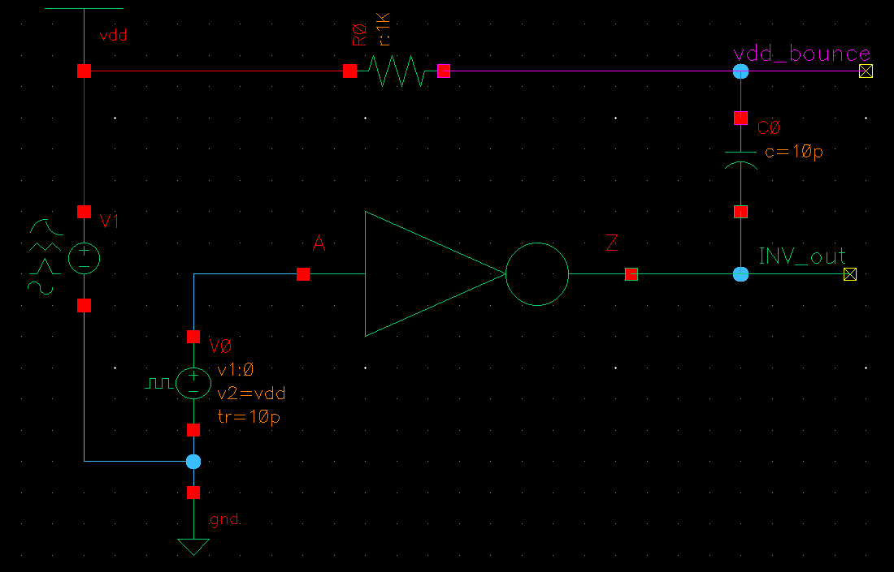

# Charge pump (зарядовый насос)

Речь пойдёт о схемном решении, позволяющем без индуктивностей получать напряжения вне области напряжений питания.

### Идея

Идея charge pump заключается в том, чтобы перенести переменный сигнал на уровень напряжения питания, а затем его выпрямить. 

Перенос на другой уровень по постоянному току классически реализуется конденсатором. Как в любом усилителе с подобной развязкой, режим можно задать резистором. В качестве источника переменного тока возьмём инвертор и подадим на вход тактовый сигнал. Получим схему, приведённую ниже.

Хорошо пропускать переменный ток конденсатор будет, когда постоянная времени значительно больше периода переменного тока $(\tau=RC\gg T_{AC})$. В схеме выше $RC>10 \space нс$, период клока $T_{AC}=3\space нс$, фронты по $10 \space пс$. Как показывает симуляция, на инверторе падает примерно столько же, как на резисторе, поэтому фактическое $RC$ в 2 раза больше.

Как видим, уже в таком примитивном случае можно поднять напряжение на $0.2 \space В$ при $vdd=1.8 \space В$.

Дальше полученный сигнал надо выпрямить. Как в обычных блоках питания, можно реализовать выпрямление диодами. Проблема подхода в том, что в чипе напряжения довольно низкие, и падение на величину прогового напряжения для диодного включения транзистора или 0.6-0.8 В для p-n перехода оказывается критичным. Поэтому лучше диоды заменить ключами, один из которых открывается по CLK, а второй - по NCLK.

### КПД

Charge pump - это силовая схема, и показателем качества для неё является КПД. Раз схему не используют в мощных приборах, можно подумать, что максимальный КПД ограничен. Однако, для идеальных ключей его величина равна единице.

Пусть в установившемся режиме с выхода за период уходит $q$. При замыкании $T_2$ тот же заряд должен стечь с конденсатора $C_1$, а при замыкании $T_1$ - поступить на него со входа $V_{in}$, чтобы напряжение на конденсаторах за период не изменилось.

Источник $V_{in}$ при зарядке $C_1$ совершает работу $A_1=V_{in} \cdot q$. Источник $CLK$ при разрядке $C_1$ на $C_2$ совершает работу $V_{clk} \cdot q$. На выходе напряжение равно $A_2=V_{in}+V_{clk}$, поэтому при разрядке $C_2$ наружу совершается работа $(V_{in}+V_{clk})q=A_1+A_2$, и $КПД=1$.

В реальности мощность рассеивается на транзисторах и металлизации. Случай с диодами неэффективен: рассеивается порядка $2 U_d \cdot q$ за период, а максимальное напряжение на выходе уменьшается на удвоенное напряжение на диоде.

$КПД\approx \frac{V_{in}+V_{clk}-2U_d}{V_{in}+V_{clk}+2U_d}$, при $U_{d} \approx 0.3\space В$ и напряжении питания $1.8 \space В$ это $0.71$. Поэтому надо выводить транзисторы в режим резистора с малым падением напряжения и обеспечивать как можно меньшее время переключения. Мощность, выделяющуюся на реальных ключах, можно оценить по изменению напряжения на конденсаторах. Ток и напряжение через замыкающийся ключ трудно посчитать аналитически, однако можно сказать, что потеря энергии будет не больше, чем максимальное напряжение на ключе, умноженное на общий заряд за период. $q=C \Delta U$, значит, надо делать ёмкость как можно больше. 

### Оптимизация

В качестве ключей можно использовать PMOS и NMOS транзисторы. В зависимости от подключения, качество их работы значительно меняется.

В наличии у нас напряжения Vdd, Vclk, Vdd+Vclk, 0 (земля). Причём в идеале Vdd значительно больше номинального напряжения транзисторов (что будет показано далее при симуляции каскада насосов).

Т2 должен пропускать максимальное напряжение в схеме и открываться в идеале меньшим напряжением. Поэтому Т2 следует сделать PMOS. Открыть его можно Vdd, а закрыть максимальным напряжением Vdd+Vclk. Оба напряжения формируются на конденсаторе C1, но не соответствуют по фазе требованиям Т2 (Vdd, когда надо закрыть транзистор, и Vdd+Vclk - когда надо открыть). Поэтому реализуется дополнительная цепь с конденсатором C3, подключённым аналогично C1 и тактируемым от инвертированного CLK.

Т1 пропускает промежуточное напряжение Vdd. Можно аналогично Т2 сделать его PMOS. Тогда открыть можно только Vclk или 0 В, а для закрытия надо подать максимальное имеющееся напряжение, что сложно в реализации. Можно подать напряжение с конденсатора C1, что соответствует диодному включению транзистора с его повышенным падением напряжения, но является рабочей идеей. Если сделать Т1 NMOS, то для открытия можно приложить Vdd+Vclk, а закрыть - подачей Vdd. По сути, сигнал управления транзистором будет общий с Т2. Проблемой может показаться большое (Vdd) напряжение между затвором и подложкой, но оно падает в основном на инверсном слое под затвором и не пробивает оксид.

Схему можно сделать симметричной, добавив второй PMOS между C3 и C2. Тогда C2 будет заряжаться в 2 раза чаще (при CLK=0 и CLK=1).

### Использование

[charge pump pll](https://patents.google.com/patent/US20030107419A1/en)

[low noise charge pump article](https://www.researchgate.net/publication/2982852_Switching_noise_and_shoot-through_current_reduction_techniques_for_switched-capacitor_voltage_doubler)

[switched capacitors charge pump for dram patent](https://patents.google.com/patent/US7994845B2/en)

[masters on area optimisation of charge pump](https://web.engr.oregonstate.edu/~moon/research/files/Ryan_Perigny.pdf)

[soft start cp](https://patents.google.com/patent/US20050174815A1/en)

