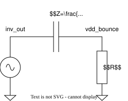
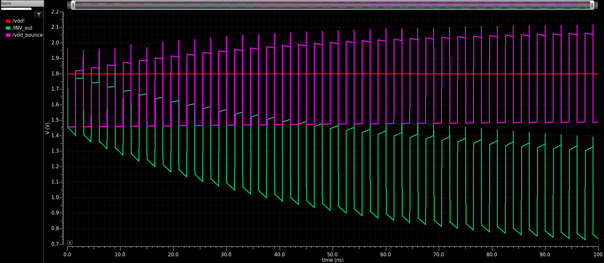
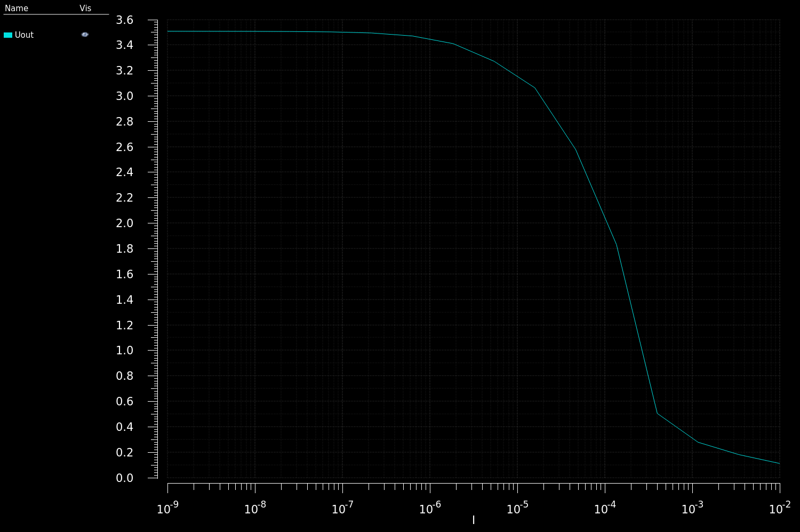
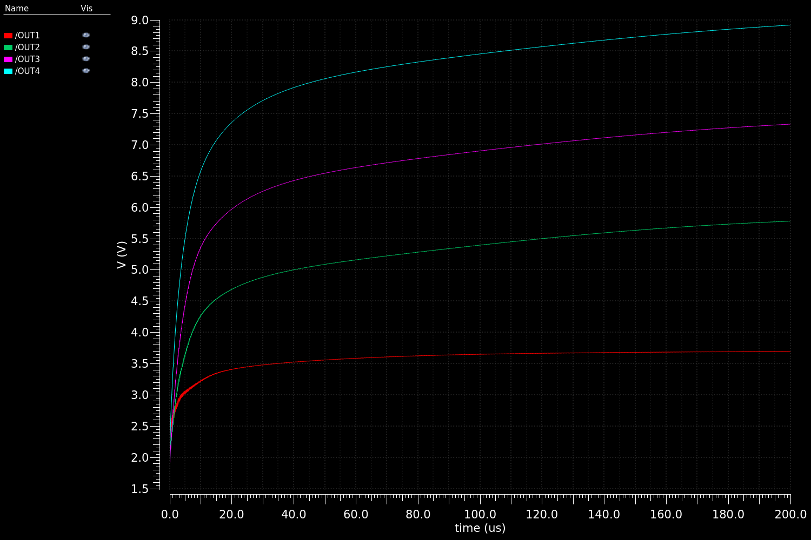
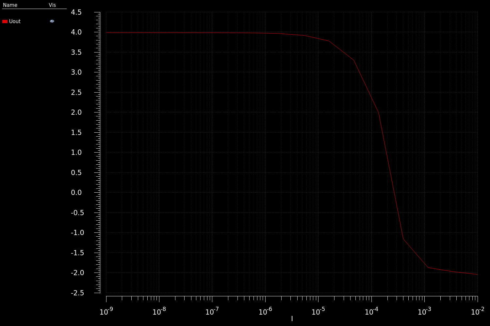
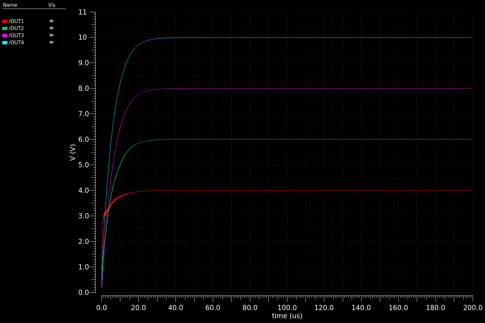
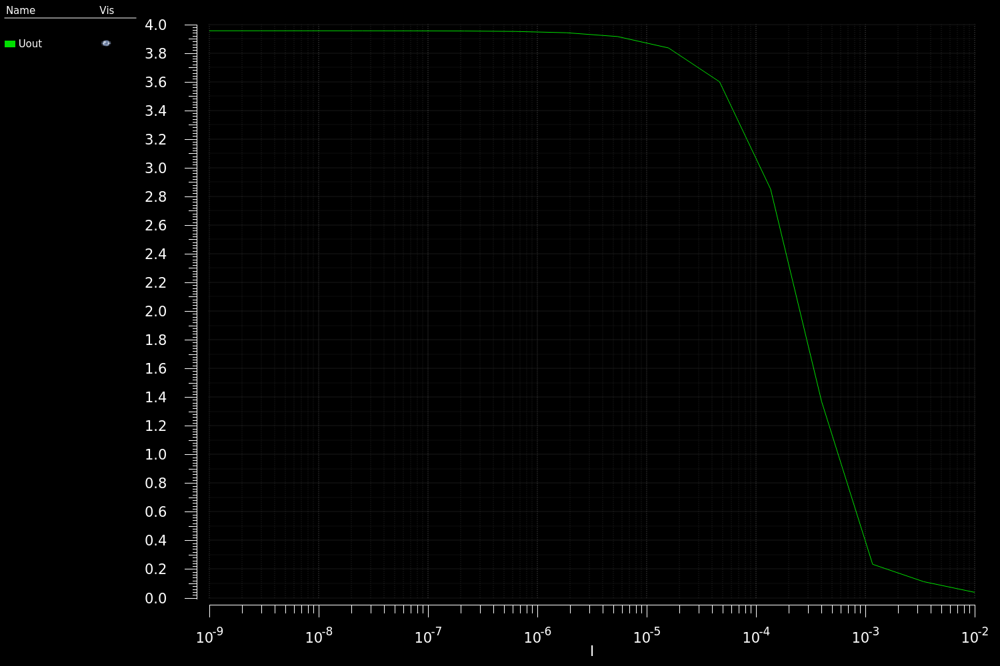
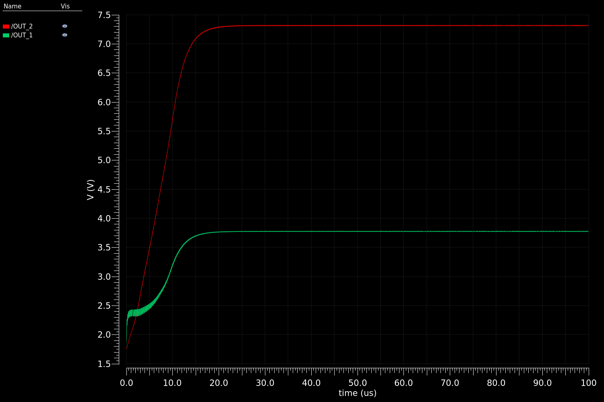
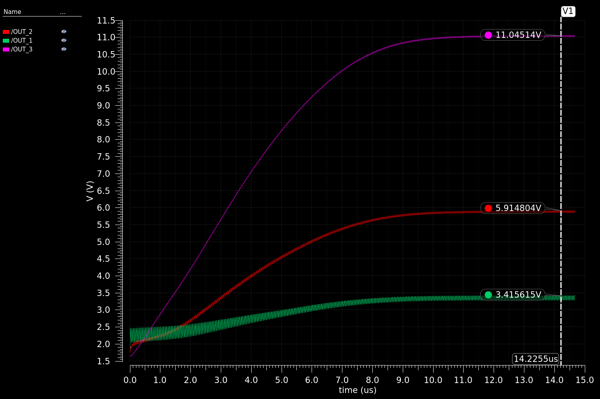
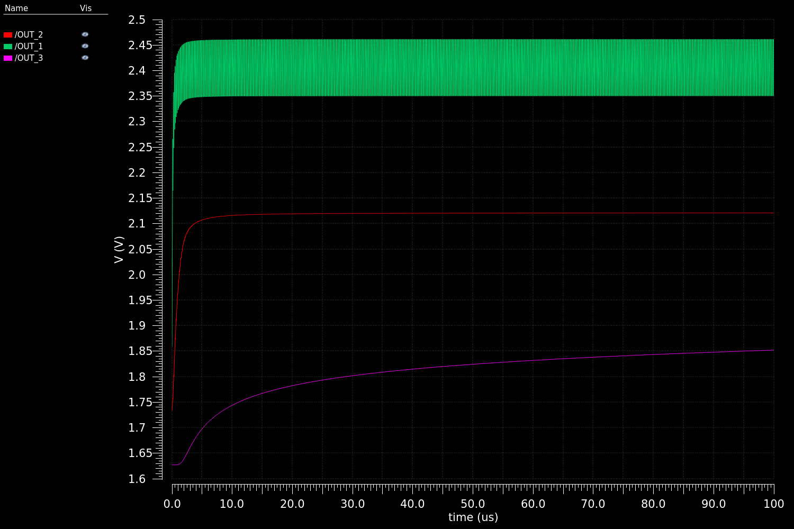

# Charge pump (зарядовый насос)

Под charge pump обычно понимают два класса схем, различающиеся принципом работы и функционалом. 

Первый из них, о котором пойдёт речь, представляет собой преобразователи напряжения без индуктивностей. 

 

[Dickson charge pump](https://ieeexplore.ieee.org/document/1050739)

Второй возникает в контексте блоков автоподстройки частоты и используется для интегрирования сигнала ошибки. Однако, это предмет отдельного разговора.

[патент с изображением схемы](https://patents.google.com/patent/US20030107419A1/en)

### Идея

В возможности реализации подобных устройств можно легко убедиться. Для этого возьмём обычную RC цепочку и соединим вывод конденсатора с генератором CLK (выход инвертора на схеме ниже), а вывод резистора поставим на питание.

Что происходит на узле vdd_bounce? 

По постоянному току конденсатор выглядит как разрыв цепи, то есть, среднее напряжение на узле равно vdd. 

При этом переменная составляющая проходит через конденсатор и даёт дополнительное смещение. Схема ведёт себя как фильтр высоких частот с передаточной функцией $K(jw)=\frac{jwRC}{1+jwRC}$. Для лучшего прохождения переменного сигнала нужно сделать постоянную времени $RC$ как можно больше. 

Общее напряжение равно сумме постоянного смещения и переменной составляющей. То есть, существуют моменты, когда напряжение на выходе больше vdd.

В схеме выше $RC>10 \space нс$, период клока $T_{AC}=3\space нс$, фронты по $10 \space пс$. Как показывает симуляция, на инверторе падает примерно столько же, как на резисторе, поэтому фактическое $RC$ в 2 раза больше.

Как видим, уже в таком примитивном случае можно поднять напряжение на $0.2 \space В$ при $V_{dd}=1.8 \space В$.

Дальше полученный сигнал надо выпрямить. Как в обычных блоках питания, можно реализовать выпрямление диодами. Решение встречается в первых схемах из 70-х. Проблема подхода в том, что в современных чипах напряжения довольно низкие, и падение на величину прогового напряжения для диодного включения транзистора или 0.6-0.8 В для p-n перехода оказывается критичным. Поэтому лучше диоды заменить ключами, один из которых открывается по CLK, а второй - по NCLK.

[Dickson charge pump](https://ieeexplore.ieee.org/document/1050739)

Схема идеального charge pump

Рассмотрим работу схем поэтапно. Сначала замыкается левый ключ, напряжение на CLK низкое. Промежуточный конденсатор заряжается до уровня напряжения питания.

Затем переключаем конденсатор на выход и подаём высокий уровень на CLK. Напряжение на выходе становится равным Vdd+Vclk. Далее цикл повторяется.

Аналогичные рассуждения можно провести для схемы с диодами. При низком уровне CLK конденсатор заряжается до $U_c(charge)=V_{dd}-U_d$ ($U_d$ - напряжение на открытом диоде, около 0.6 В). При подаче высокого уровня CLK левый диод смещается закрывается напряжением $U_c(discharge)=V_{dd}-U_d+V_{clk}$, а правый открывается и проводит на выход суммарное напряжение, но на $U_d$ меньше: $U_{out}=U_c(discharge)-U_d=U_{dd}+V_{clk}-2U_d$. 

### КПД

Charge pump - это силовая схема, и показателем качества для неё является КПД. Раз схему не используют в мощных приборах, можно подумать, что максимальный КПД ограничен. Однако, для идеальных ключей его величина равна единице.

Рассмотрим вначале вспомогательную классическую задачу. Два конденсатора различной ёмкости C_1 и C_2, заряженные до напряжений U_1 и U_2 объединяются в параллель. Найти общее напряжение U_3 и потерю энергии при взаимодействии Q.

Общий заряд сохраняется:

$q_1+q_2=C_1U_1+C_2U_2=(C_1+C_2)U_3=q_3$

Отсюда $U_3=\frac{C_1U_1+C_2U_2}{C_1+C_2}$.

Потеря энергии равна убыли энергии, запасённой на конденсаторах: 

$Q=E_3-(E_1+E_2)=\frac{(C_1+C_2)U_3^2}{2}-\frac{C_1U_1^2}{2}-\frac{C_2U_2^2}{2}$

Подставляем выражение для U_3:

$Q=\frac{(C_1+C_2)(C_1U_1+C_2U_2)^2}{2(C_1+C_2)^2}-\frac{C_1U_1^2}{2}-\frac{C_2U_2^2}{2}$

Упрощаем:

$Q=\frac{(C_1U_1+C_2U_2)^2-C_1U_1^2(C_1+C_2)-C_2U_2^2(C_1+C_2)}{2(C_1+C_2)}$

$Q=\frac{C_1^2U_1^2+2C_1C_2U_1U_2+C_2^2U_2^2-C_1^2U_1^2-C_1C_2U_1^2-C_1C_2U_2^2-C_2^2U_2^2}{2(C_1+C_2)}$

$Q=\frac{2C_1C_2U_1U_2-C_1C_2U_1^2-C_1C_2U_2^2}{2(C_1+C_2)}$

$Q=-\frac{C_1C_2(U_1-U_2)^2}{2(C_1+C_2)}$

Знак минус получился из-за уменьшения энергии и далее будет опущен.

Заменим $U_2=U_1-\Delta U$ (напряжение на правом конденсаторе на известную величину меньше).

$$Q=\frac{C_1C_2(\Delta U)^2}{2(C_1+C_2)}$$

Выразим КПД. Полезной будем считать энергию, переданную от C_1 к C_2, то есть, изменение энергии C_2.

$$\Delta E_2=\frac{C_2U_3^2}{2}-\frac{C_2U_2^2}{2}$$

$$\Delta E_2=\frac{C_2(\frac{C_1U_1+C_2U_2}{C_1+C_2})^2}{2}-\frac{C_2U_2^2}{2}$$

$$\Delta E_2=\frac{C_2(C_1^2U_1^2+2C_1C_2U_1U_2+C_2^2U_2^2)-C_2(C_1+C_2)^2U_2^2}{2(C_1+C_2)^2}$$

$$\Delta E_2=\frac{C_2(C_1^2U_1^2+2C_1C_2U_1U_2+C_2^2U_2^2)-C_2(C_1^2U_2^2+2C_1C_2U_2^2+C_2^2U_2^2)}{2(C_1+C_2)^2}$$

$$\Delta E_2=\frac{C_2(C_1^2U_1^2+2C_1C_2U_1U_2)-C_2(C_1^2U_2^2+2C_1C_2U_2^2)}{2(C_1+C_2)^2}$$

$$\Delta E_2=\frac{C_2(C_1^2(U_1-U_2)(U_1+U_2)+2C_1C_2U_1U_2-2C_1C_2U_2^2)}{2(C_1+C_2)^2}$$

$$\Delta E_2=\frac{C_2(C_1^2\Delta U(2U_1-\Delta U)+2C_1C_2(U_1-\Delta U)\Delta U)}{2(C_1+C_2)^2}$$

$$\Delta E_2=\frac{C_1C_2\Delta U(C_1(2U_1-\Delta U)+2C_2(U_1-\Delta U))}{2(C_1+C_2)^2}$$

$$\Delta E_2=\frac{C_1C_2\Delta U(C_1(U_1+U_2)+2C_2U_2)}{2(C_1+C_2)^2}$$

$$\eta=\frac{\Delta E_2}{\Delta E_2+Q}$$

$$\eta=\frac{C_1(2U_1-\Delta U)+2C_2(U_1-\Delta U)}{C_1(2U_1-\Delta U)+2C_2(U_1-\Delta U)+\Delta U (C_1+C_2)}$$

$$\eta=\frac{C_1(2U_1-\Delta U)+2C_2(U_1-\Delta U)}{2C_1U_1-C_1\Delta U+2C_2U_1-2C_2\Delta U+C_1\Delta U+C_2\Delta U}$$

$$\eta=\frac{C_1(2U_1-\Delta U)+2C_2(U_1-\Delta U)}{2C_1U_1+2C_2U_1-C_2\Delta U}$$

$$\eta=\frac{C_1(2U_1-\Delta U)+2C_2(U_1-\Delta U)}{C_2(2U_1-\Delta U)+2C_1U_1}$$

$$\eta=\frac{2U_1(C_1+C_2)-C_1\Delta U-2C_2\Delta U}{2U_1(C_1+C_2)-C_2\Delta U}$$

$$\eta(C_1=C_2, U_1=\Delta U)=\frac{C_1(U_1)}{C_1(U_1)+2C_1U_1}=\frac{1}{3}$$

$$\eta=\frac{C(U/2)^2}{C(U/2)^2+C(U)^2/2}=\frac{1}{3}$$

# STAROE

Пусть в установившемся режиме с выхода за период уходит $q$. При замыкании $T_2$ тот же заряд должен стечь с конденсатора $C_1$, а при замыкании $T_1$ - поступить на него со входа $V_{in}$, чтобы напряжение на конденсаторах за период не изменилось.

Источник $V_{in}$ при зарядке $C_1$ совершает работу $A_1=V_{in} \cdot q$. Источник $CLK$ при разрядке $C_1$ на $C_2$ совершает работу $V_{clk} \cdot q$. На выходе напряжение равно $A_2=V_{in}+V_{clk}$, поэтому при разрядке $C_2$ наружу совершается работа $(V_{in}+V_{clk})q=A_1+A_2$, и $КПД=1$.

В реальности мощность рассеивается на транзисторах и металлизации. Случай с диодами неэффективен: рассеивается порядка $2 U_d \cdot q$ за период, а максимальное напряжение на выходе уменьшается на удвоенное напряжение на диоде.

$КПД\approx \frac{V_{in}+V_{clk}-2U_d}{V_{in}+V_{clk}+2U_d}$, при $U_{d} \approx 0.3\space В$ и напряжении питания $1.8 \space В$ это $0.71$. Поэтому надо выводить транзисторы в режим резистора с малым падением напряжения и обеспечивать как можно меньшее время переключения. Мощность, выделяющуюся на реальных ключах, можно оценить по изменению напряжения на конденсаторах. Ток и напряжение через замыкающийся ключ трудно посчитать аналитически, однако можно сказать, что потеря энергии будет не больше, чем максимальное напряжение на ключе, умноженное на общий заряд за период. $q=C \Delta U$, значит, надо делать ёмкость как можно больше. 

### Оптимизация (выбор топологии)

Для достижения адекватных значений КПД можно учесть следующие эффекты:

- падение напряжения на ключах,
- обратный ток при одновременном переключении CLK и NCLK,
- потери на управляющей логике.

Устранить падение напряжения на ключах можно правильным использованием nmos и pmos. В наличии у нас напряжения Vdd, Vclk, Vdd+Vclk, 0 (земля). Причём в идеале Vdd значительно больше номинального напряжения транзисторов (что будет показано при рассмотрении способов применения).

Т2 должен пропускать максимальное напряжение в схеме и открываться в идеале меньшим напряжением. Поэтому Т2 следует сделать PMOS. Открыть его можно Vdd, а закрыть максимальным напряжением Vdd+Vclk. Оба напряжения формируются на конденсаторе C1, но не соответствуют по фазе требованиям Т2 (Vdd, когда надо закрыть транзистор, и Vdd+Vclk - когда надо открыть). Поэтому реализуется дополнительная цепь с конденсатором C3, подключённым аналогично C1 и тактируемым от инвертированного CLK.

Т1 пропускает промежуточное напряжение Vdd. Можно аналогично Т2 сделать его PMOS. Тогда открыть можно только Vclk или 0 В, а для закрытия надо подать максимальное имеющееся напряжение, что сложно в реализации. Можно подать напряжение с конденсатора C1, что соответствует диодному включению транзистора с его повышенным падением напряжения, но является рабочей идеей. 

схема на pmos

Выходная ВАХ в логарифмической шкале. Питание 2 В, ожидаемое значение на выходе 4 В.

Каскад. Питание 2 В, ожидаемое значение на выходах 4, 6, 8, 10 В.

Если сделать Т1 NMOS, то для открытия можно приложить Vdd+Vclk, а закрыть - подачей Vdd. По сути, сигнал управления транзистором будет общий с Т2. Проблемой может показаться большое (Vdd) напряжение между затвором и подложкой, но оно падает в основном на инверсном слое под затвором и не пробивает оксид.

схема с nmos работает лучше

Выходная ВАХ в логарифмической шкале. Питание 2 В, ожидаемое значение на выходе 4 В.

Каскад. Питание 2 В, ожидаемое значение на выходах 4, 6, 8, 10 В.

Схему можно сделать симметричной, добавив второй PMOS между C3 и C2. Тогда C2 будет заряжаться в 2 раза чаще (при CLK=0 и CLK=1).

 

симметричная схема с nmos, [reference article](https://ieeexplore.ieee.org/document/661206)

 

симметричная схема с pmos

Для получения высоких напряжений charge pump каскадируют. В описанных ранее схемах зависимость выходного напряжения от числа каскадов линейная (каждый увеличивает на Vclk). Можно сделать рост квадратичным, если Vclk увеличивать вместе с Vdd. Делается это преобразователем уровней, в качестве которого обычные инверторы и буферы подходят плохо (только для малой разницы напряжений).

схема преобразователя уровней

Классический shifter напоминает защёлку (latch), только для управления используются затворы nmos. Причём для надёжного переключения nmos должны быть значительно шире, чем pmos.

схема charhge pump с преобразованием clk

Выходная ВАХ в логарифмической шкале. Питание 2 В, ожидаемое значение на выходе 4 В.

Каскад из 2 стадий. Питание 2 В, ожидаемое значение на выходах 4, 8 В.

Каскад из 3 стадий, первая из 4 параллельных ячеек, вторая из 2, третья из 1. Питание 2 В, ожидаемое значение на выходах 4, 8, 16 В.

Каскад из 3 стадий, одинаковые размеры ячеек. Слабые level shifter не могут питать силовой вход clk.

Часть потерь происходит во время одновременного замыкания ключей. Чтобы их уменьшить, можно использовать диоды, разные clk без перекрытия переключений и неподходящих фаз, либо как можно сильнее уменьшить фронт и срез clk.

### Использование

Charge pump используются в DRAM и SRAM, для вывода в режим более мощных преобразователей (DC-DC, например), в случае слабого источника (порядка 0.2 В) для low power схем, для создания узлов с нужными для аналоговых блоков напряжениями. 

[low noise charge pump article](https://www.researchgate.net/publication/2982852_Switching_noise_and_shoot-through_current_reduction_techniques_for_switched-capacitor_voltage_doubler)

[switched capacitors charge pump for dram patent](https://patents.google.com/patent/US7994845B2/en)

[soft start cp](https://patents.google.com/patent/US20050174815A1/en)

