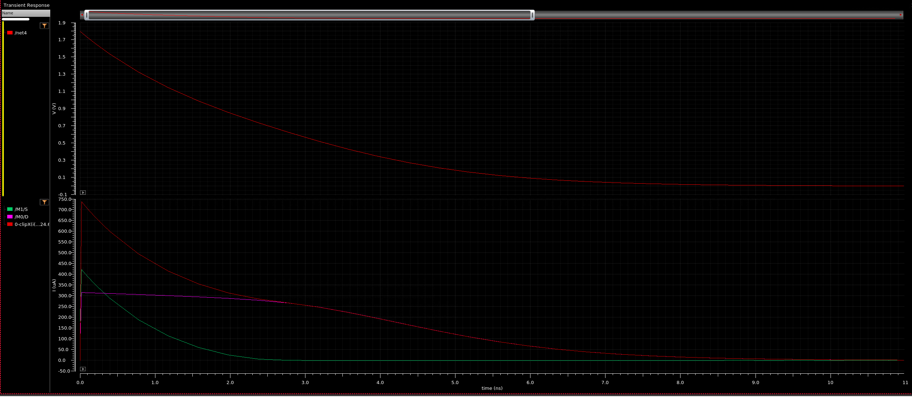

# Использование проходных ключей

Проходной ключ - параллельное соединение PMOS и NMOS. В связи с этим, его использование не ограничивается коммутацией элементов схемы. Эта страница об использовании ключей в аналоговых и цифровых приложениях.

## Проходной ключ как ключ

> Здесь рассматриваются потери на ключе как на неидеальном элементе в контексте распространения различных сигналов.

**Прохождение нуля и единицы**

Пусть конденсатор на схеме заряжен до VDD. Для изучения пропускания нуля попробуем разрядить его через полностью открытый ключ.

Ток через конденсатор:

$I=C \frac{dU}{dt}$

Пусть у транзисторов одинаковое пороговое напряжение $U_{th}=0.3 \space В$ (по модулю), канал индуцированный, $V_{DD}=1.8 \space В$. Размеры транзисторов согласованы для равенства крутизн $K_N=K_P=K=375\space \frac{мкА}{В^2}$.

Ток через NMOS начальный:

$I_N=\frac{K}{2}(V_{DD}-U_{th})^2=422 \space мкА$

До $U=V_{DD}-U_{th}=1.5 \space В$ NMOS разряжает конденсатор постоянным током.

Ток через PMOS начальный:

$I_P=\frac{K}{2}(U-U_{th})^2 \leq 422 \space мкА$

До $U=U_{th}$ PMOS разряжает конденсатор постоянно убывающим током, при достижении $U_{th}$ закрывается окончательно. 

После $U=1.5 \space В$ зависимость тока от напряжения NMOS становится параболической. Ток уменьшается, но транзистор работает как резистор, и падение напряжения на нём может быть мало.

> То есть, проходной ключ не сужает диапазон напряжений за счёт использования двух транзисторов, хотя бы один из которых открыт и пропускает ток.

Аналитическое выражение для процесса разрядки найти можно, но ВАХ даже идеального транзистора в triode region довольно громоздкая, из-за чего интегрирование долгое и неприятное. Поэтому лучше получать оценки через аппроксимацию.

Большую часть времени для NMOS $I_N=K((V_{DD}-U_{th})U-\frac{U^2}{2})$. Заменим малосигнальным резистором $g_N=K(V_{DD}-U_{th}-U)$.

Возьмём $U=0$.

$g_N=K(V_{DD}-U_{th})$

$R=\frac{1}{g_N}=\frac{1}{375\cdot 10^{-6}\cdot1.5}=1.78 \space кОм$

Для конденсатора в 1 пФ постоянная времени составит $\tau=RC=1.78 нс$.

Возьмём $U=\frac{VDD}{2}$ - среднее напряжение на конденсаторе при линейной разрядке.

$R=\frac{1}{g_N}=\frac{1}{375\cdot 10^{-6}\cdot0.6}=4.44 \space кОм$

Та же постоянная времени будет $\tau=RC=4.44 нс$.

В реальной симуляции с транзисторами с похожими параметрами график разрядки будет следующий:

Видно, что при большой разнице напряжений ток пропускают оба транзистора. При половине током PMOS (зелёный) уже можно пренебречь, а ток через NMOS (розовый) начинает падать. Сумарный ток (красный, внизу) почти пропорционален напряжению на ёмкости, а само напряжение уменьшается почти линейно (из-за чего аппроксимация резистором выглядит адекватно). Время переключения составляет $\tau=5\spaceнс$, что довольно близко к постоянной времени, полученной аналитически.

Таким образом, для расчёта времени переключения можно заменить ключ эквивалентным сопротивлением $R=\frac{1}{K(V_{DD}-U_{th}-\frac{V_{DD}}{2})}=\frac{1}{K(\frac{V_{DD}}{2}-U_{th})}$.

**Прохождение переменного сигнала**

Пусть нужно коммутировать малый переменный сигнал, расположенный на уровне $U$ по постоянному току, при помощи ключа с теми же параметрами, что выше. Найти паразитные параметры ключа: сопротивление и ёмкость, оценить их влияние в случае, когда нагрузкой служит ёмкость затвора величиной $10 \space фФ$. Суммарная электростатическая ёмкость диэлектрика под затворами ключа $20 \spaceфФ$. Как изменится вклад ключа для нагрузки с внутренним сопротивлением $R=10 \space кОм$?

Оба транзистора в triode region, ток через каждый:

$I=K((U_{GS}-U_{th})U_{DS}-\frac{U_{DS}^2}{2})$

Рассмотрим приращение для анализа по малому сигналу.

$dI=K(U_{GS}-U_{th}-U_{DS})dU_{DS}+K(U_{DS})dU_{GS}$

При нулевом напряжении по постоянному току $U_{DS}=0$, как в нашем случае, транзистор ведёт себя как резистор, проводимость которого $g=K(U_{GS}-U_{th})$. В случае ненулевого напряжения сток-исток сопротивление увеличивается, и к нему в параллель добавляется эквивалентный источник тока $K(U_{DS})dU_{GS}=g_mdU_{GS}$, как в режиме насыщения. Анализ этого случая требует аккуратности: истоки у транзисторов с разных сторон, и на токи оказывает влияние изменение напряжения на любом из узлов ключа.

Малосигнальная схема с учётом симметричного распределения ёмкости затвор-канал между узлами будет выглядеть так:

Ёмкость в $10 \space фФ$ обозначена $C$.

Оценим граничную частоту.

Суммарная проводимость ключа:

$g=g_N+g_P=K(U_{GSN}-U_{th})+K(U_{GSP}-U_{th})=$
$=K(V_{DD}-U-U_{th})+K(U-U_{th})=K(V_{DD}-2U_{th})$

От напряжения по постоянному току не зависит.

Сопротивление:

$R=\frac{1}{g}=\frac{1}{375\cdot(1.8-0.6)}=2.22 \space кОм$

Постоянная времени:

$\tau = 2RC = 2 \cdot 2.22 \cdot 10^{3} \cdot 10 \cdot 10^{-15}=44.4\space пс$

>Граничная частота $\omega=\frac{1}{\tau}=22.5\cdot 10^9=22.5\space ГГц$. Ключ может пропускать довольно высокие частоты.

> При сопротивлении нагрузки в $10 \space кОм$ на ключе падает значительная часть напряжения: $\frac{2.22}{10+2.22}=0.18$, это почти $\frac{1}{5}$! Понижение сопротивления ключа возможно, и для этого нужно увеличить ширину транзисторов.

## Цифровые схемы на ключах

Проходные ключи можно использовать для построения логических схем. В отличие от стандартного подхода, когда инвертор в аналоговом смысле является усилителем, проходные ключи сигнал не усиливают, а только пропускают. То есть, вклад ключа аналогичен появлению последовательно включённого транзистора в каждой из цепей установки нуля и единицы, и для поддержания быстродействия схемы нужно увеличивать ширины транзисторов.

Теперь, рассматривая ключи как идеальные элементы, построим несколько схем с их использованием.

**MUX**

Задача ключа - подключать и отключать сигнал. Такую же задачу решают мультиплексоры и демультиплексоры. Поэтому такие ячейки довольно компактно реализуются на ключах.

Чтобы сделать мультиплексор из 2 в 1, нужно 2 ключа для соединения входов с выходами. Один ключ включается по единице на управляющем входе, второй - по нулю. Однако, поскольку каждый требует для управления также инвертированный управляющий сигнал, потребуется всего один инвертор. Получается схема:

Здесь всего 6 транзисторов. Для сравнения, в классической схеме $3\cdot4+2=14$ транзисторов.

Если на схеме с проходными ключами переименовать вход $out$ в $in$, а $in[1:0]$ в $out[1:0]$, сразу получается демультиплексор. Это возможно из-за внутренней симметрии ключа.

**XOR**

Ключи поволяют сэкономить место в отдельных стандартных ячейках, которые обычно требуют большого количества логики. Рассмотрим в качестве примера элемент XOR. Преобразуем логику к СДНФ:

$F=a \oplus b=a\overline{b}+\overline{a}b$

Фактически, это логика мультиплексирования $b$ и $\overline{b}$. Из-за этого для реализации XOR с помощью полученной схемы мультиплексора требуется добавить всего один инвертор. Число транзисторов увеличивается до 8.

Хотя это уже компактнее обычной реализации, можно сделать ячейку ещё компактнее, если допустить один хитрый приём, как сделали в [этой](https://www.researchgate.net/publication/224349141_Design_of_a_rad-hard_library_of_digital_cells_for_space_applications) статье. Фактически, в инверторе объединяются функции инверсии и ключа.

Идея заключается в том, чтобы рассматривать входы питания инвертора как управляющие.

Для такого инвертора отразим возможные состояния в таблице истинности.

|   A    |   B    |   C    |    F    |
| :----: | :----: | :----: | :-----: |
|   0    |   0    |   0    |    Z    |
|   0    |   0    |   1    |    Z    |
|   0    |   1    |   0    |    1    |
|   0    |   1    |   1    |    1    |
|   1    |   0    |   0    |    0    |
|   1    |   0    |   1    |    Z    |
|   1    |   1    |   0    |    0    |
|   1    |   1    |   1    |    Z    |

Анализ с двумя управляющими сигналами избыточен, положим $C=0$. 

$F = (B) \space ? \space \overline{A} \space:\space Z$ 

$B$ при этом работает как управляющий сигнал проходного ключа, и такой инвертор оказывается логически эквивалентным последовательному соединению проходного ключа и инвертора:

В точности такую конструкцию можно обнаружить в построенном ранее элементе XOR. Заменив, получим схему, состоящую всего из 6 транзисторов.

**D-ff**

**???**

## Проходной ключ как источник тока

Здесь рассматриваются аналоговые приложения ключей как КМОП-пар в режиме источника тока.

**разрядка/зарядка конденсатора**

**замена большого сопротивления**

## Проходной ключ как управляемый резистор

Здесь рассматриваются приложения ключей как управляемых элементов.

